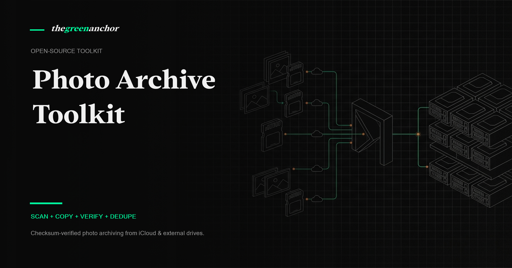

# Photo Archive Toolkit 📸



> [!NOTE]
> **Open-Source Photo Archiving for Mac & Windows**
> A non-destructive, copy-first, checksum-verified photo archiving system designed for archiving iCloud Photos, Apple Photos libraries, Lightroom catalogs, and external backup drives onto external storage using Codex.

---

## 🏷️ Repository Topics

`photo-archive` · `icloud-photos` · `codex` · `checksum-verification` · `sha256` · `backup` · `python` · `cli` · `macos` · `photo-library`

---

## ⚡ Quickstart (Mac & Codex)

### 1. Install the CLI
Open Terminal on your Mac inside this repository folder:

```bash
python3 -m pip install -e .
```

### 2. Run with Codex CLI
Open Codex CLI on your Mac:

```bash
codex
```

Paste the prompt from [`prompts/codex-mac-prompt.md`](prompts/codex-mac-prompt.md):

> "Read README.md first. Inspect this Mac for Apple Photos libraries, Lightroom catalogs, and external backup drives. Help me run `photo-archive scan`, `copy`, and `verify` to back up my photos to my external hard drive."

---

## 🛡️ Core Rules & Safety Guarantees

1. **Non-Destructive (Copy-Only)**: The tool **never deletes** your original photos or source files.
2. **Checksum Verification**: Uses streaming SHA-256 hashes to verify every single file before and after copying.
3. **Metadata & Sidecar Preservation**: Uses `shutil.copy2` to preserve file creation/modification dates and copies associated sidecars (`.xmp`, `.aae`, `.json`).
4. **Idempotent**: Re-running `copy` will safely skip files that already exist in the archive with matching size and SHA-256.
5. **Apple Photos Rule**: **Never scan `.photoslibrary` package directories directly.** Export unmodified originals first to an external staging folder.

---

## 📁 Source Classes & Folder Layout

When scanning, assign each source directory a **`--source-class`**. The CLI automatically organizes files into the target folder structure:

| Source Class (`--source-class`) | Target Category Folder | Example Use Case |
| :--- | :--- | :--- |
| `icloud-export` | `01-icloud-photos/` | Exported unmodified originals from Apple Photos / iCloud |
| `lightroom-classic-originals` | `02-lightroom-classic/` | Local Lightroom Classic catalog photo folders |
| `lightroom-cloud-originals` | `02-lightroom-cloud/` | Lightroom Downloader cloud exports |
| `mac-local` | `03-mac-local/` | Screenshots or local photo folders on Mac internal storage |
| `external-backup-drive` | `04-external-backup-drives/` | Camera SD cards, old hard drive dumps, backup drives |

### Destination Layout Structure
`<archive-root>/<category>/<batch-name>/<relative-path>`

---

## 🚀 4-Step Archiving Workflow

### Step 1: Export Apple Photos (if archiving iCloud / Apple Photos)
1. Open the **Photos app** on your Mac.
2. Ensure originals are downloaded locally (**Photos** $\rightarrow$ **Settings** $\rightarrow$ **Download Originals to this Mac**).
3. Select the photos/albums you want to archive.
4. Go to **File** $\rightarrow$ **Export** $\rightarrow$ **Export Unmodified Original**.
5. Check **Export IPTC as XMP** if available.
6. Choose a staging folder on your external drive (e.g., `/Volumes/MyPassport/_export_staging/2026-icloud-export`).

---

### Step 2: Scan Source Directories (`scan`)
Generates a SHA-256 manifest and optional CSV summary without modifying any files.

```bash
photo-archive scan \
  --source-root "/Volumes/MyPassport/_export_staging/2026-icloud-export" \
  --source-class icloud-export \
  --batch-name "2026-07-icloud-photos" \
  --manifest-out "./manifests/icloud-scan.json" \
  --csv-out "./manifests/icloud-scan.csv"
```

---

### Step 3: Copy to External Hard Drive (`copy`)
Copies files from the manifest into the structured archive on your external hard drive.

```bash
photo-archive copy \
  --manifest "./manifests/icloud-scan.json" \
  --archive-root "/Volumes/MyPassport/Photo Archive" \
  --report-out "./manifests/icloud-copy-report.json"
```

---

### Step 4: Verify & Check for Duplicates (`verify` & `dedupe-report`)

**Verify File Integrity:**
```bash
photo-archive verify \
  --manifest "./manifests/icloud-scan.json" \
  --archive-root "/Volumes/MyPassport/Photo Archive" \
  --report-out "./manifests/icloud-verify-report.json"
```

**Find Exact Duplicate Files Across Batches:**
```bash
photo-archive dedupe-report \
  --manifest "./manifests/icloud-scan.json" \
  --report-out "./manifests/icloud-duplicates.json"
```

---

## 🛠️ Supported File Types

* **Standard Images**: `.jpg`, `.jpeg`, `.heic`, `.heif`, `.png`, `.tiff`, `.webp`
* **RAW Formats**: `.arw` (Sony), `.cr2`/`.cr3` (Canon), `.nef` (Nikon), `.dng`, `.raf` (Fuji), `.orf`, `.rw2`
* **Video Formats**: `.mov`, `.mp4`, `.m4v`, `.avi`, `.mkv`, `.3gp`
* **Sidecars**: `.xmp`, `.aae`, `.json`

---

## 📄 License & Credits

Built with ❤️ by [The Green Anchor](https://thegreenanchor.com). MIT License.
